# Code Review Agent — Database Schema Documentation

## 1. Overview & Architecture

The Code Review Agent database is built on **PostgreSQL** hosted on **Supabase**. It provides multi-tenant, autonomous code analysis lifecycle management.

### Key Design Principles:
1. **Strict Multi-Tenant Isolation**: Row Level Security (RLS) is enabled across all 8 tables. Data access is restricted using optimized cached session claims `((select auth.uid()) = user_id)`.
2. **Covering Indexes for Performance**: 100% of foreign keys and critical query access paths (by `user_id`, `status`, `severity`, `commit_sha`) have dedicated B-Tree indexes.
3. **Denormalized Tenant Keys**: Child entities (`review_findings`, `review_files`, `review_results`, `review_history`) carry `user_id` to eliminate costly multi-table joins during high-throughput RLS evaluation.
4. **Auditability & Traceability**: Automated `updated_at` triggers and a dedicated `review_history` event ledger capture state progressions and quality metrics over time.

---

## 2. Entity-Relationship (ER) Diagram

```mermaid
erDiagram
    AUTH_USERS ||--|| PROFILES : "1:1 profile"
    AUTH_USERS ||--o{ REPOSITORY_CONNECTIONS : "owns"
    AUTH_USERS ||--o{ REPOSITORIES : "owns"
    REPOSITORY_CONNECTIONS ||--o{ REPOSITORIES : "connects"
    REPOSITORIES ||--o{ REVIEW_JOBS : "triggers"
    REVIEW_JOBS ||--o{ REVIEW_FILES : "analyzes"
    REVIEW_JOBS ||--o{ REVIEW_FINDINGS : "detects"
    REVIEW_FILES ||--o{ REVIEW_FINDINGS : "contains"
    REVIEW_JOBS ||--|| REVIEW_RESULTS : "summarizes"
    REPOSITORIES ||--o{ REVIEW_HISTORY : "tracks"
    REVIEW_JOBS ||--o{ REVIEW_HISTORY : "logs"

    PROFILES {
        uuid id PK,FK "auth.users.id"
        text display_name
        text avatar_url
        text company
        text bio
        text github_username
        jsonb notification_preferences
        timestamptz created_at
        timestamptz updated_at
    }

    REPOSITORY_CONNECTIONS {
        uuid id PK
        uuid user_id FK
        text provider "github, gitlab, etc."
        text account_identifier
        text account_name
        text account_avatar_url
        text installation_id
        text access_token_encrypted
        text[] scopes
        text status "active, revoked, expired, error"
        jsonb metadata
        timestamptz created_at
        timestamptz updated_at
    }

    REPOSITORIES {
        uuid id PK
        uuid user_id FK
        uuid connection_id FK
        text provider
        text repo_identifier
        text name
        text full_name
        text clone_url
        text html_url
        text default_branch
        boolean is_private
        text language
        text description
        integer stars_count
        integer forks_count
        boolean is_active
        jsonb settings
        timestamptz last_reviewed_at
        timestamptz created_at
        timestamptz updated_at
    }

    REVIEW_JOBS {
        uuid id PK
        uuid repository_id FK
        uuid user_id FK
        text trigger_type "manual, pull_request, push, scheduled, api"
        integer pull_request_number
        text pull_request_title
        text branch
        text base_branch
        text commit_sha
        text commit_message
        text commit_author
        text status "queued, cloning, scanning, analyzing, completed, failed, cancelled"
        integer progress "0-100"
        text error_message
        text error_stack
        timestamptz started_at
        timestamptz completed_at
        integer total_files
        integer total_lines
        integer critical_count
        integer high_count
        integer medium_count
        integer low_count
        integer info_count
        numeric quality_score "0.0 - 100.0"
        jsonb metadata
        timestamptz created_at
        timestamptz updated_at
    }

    REVIEW_FILES {
        uuid id PK
        uuid review_job_id FK
        uuid repository_id FK
        uuid user_id FK
        text file_path
        text language
        text status "pending, analyzed, skipped, failed"
        integer lines_count
        integer findings_count
        text checksum
        integer duration_ms
        text error_message
        timestamptz created_at
    }

    REVIEW_FINDINGS {
        uuid id PK
        uuid review_job_id FK
        uuid repository_id FK
        uuid review_file_id FK
        uuid user_id FK
        text file_path
        text severity "critical, high, medium, low, info"
        text category "security, bug_risk, performance, code_style, architecture, best_practice"
        text cwe_id
        text owasp_category
        text title
        text description
        integer line_start
        integer line_end
        integer column_start
        integer column_end
        text snippet
        text recommendation
        text suggested_fix
        boolean fix_applied
        text status "open, resolved, dismissed, false_positive, ignored"
        text dismissed_reason
        timestamptz dismissed_at
        jsonb metadata
        timestamptz created_at
        timestamptz updated_at
    }

    REVIEW_RESULTS {
        uuid id PK
        uuid review_job_id FK "unique"
        uuid repository_id FK
        uuid user_id FK
        text verdict "passed, passed_with_warnings, failed, blocked"
        numeric score "0.0 - 100.0"
        text summary_markdown
        text[] strengths
        text[] improvements
        integer critical_issues
        integer high_issues
        integer medium_issues
        integer low_issues
        integer info_issues
        integer rules_evaluated
        integer execution_time_ms
        jsonb raw_report
        timestamptz created_at
    }

    REVIEW_HISTORY {
        uuid id PK
        uuid repository_id FK
        uuid user_id FK
        uuid review_job_id FK
        text event_type
        uuid actor_id FK
        text commit_sha
        numeric quality_score
        integer critical_count
        integer high_count
        text description
        jsonb details
        timestamptz created_at
    }
```

---

## 3. Entity Catalog

### 1. `profiles`
Links directly 1-to-1 with Supabase `auth.users`. Automatically created on user signup via `handle_new_user()` trigger.
- **Primary Key**: `id` (`uuid`, references `auth.users.id` with `ON DELETE CASCADE`)
- **Key Fields**: `display_name`, `avatar_url`, `company`, `bio`, `github_username`, `notification_preferences`
- **Security**: Can only be read/updated by the profile owner (`auth.uid() = id`).

### 2. `repository_connections`
Manages third-party VCS accounts (GitHub OAuth app, GitHub App installations).
- **Primary Key**: `id` (`uuid`)
- **Key Fields**: `user_id`, `provider`, `account_identifier`, `account_name`, `installation_id`, `access_token_encrypted`, `status`
- **Constraints**: Unique per `(user_id, provider, account_identifier)`

### 3. `repositories`
Repositories tracked for automated or on-demand reviews.
- **Primary Key**: `id` (`uuid`)
- **Key Fields**: `user_id`, `connection_id`, `full_name`, `clone_url`, `default_branch`, `is_private`, `settings`, `last_reviewed_at`
- **Constraints**: Unique per `(user_id, provider, full_name)`

### 4. `review_jobs`
Represents an individual code review run on a branch, commit, or pull request.
- **Primary Key**: `id` (`uuid`)
- **Key Fields**: `repository_id`, `user_id`, `trigger_type`, `pull_request_number`, `branch`, `commit_sha`, `status`, `progress`, `quality_score`, `critical_count`, `high_count`
- **Statuses**: `queued` -> `cloning` -> `scanning` -> `analyzing` -> `completed` / `failed` / `cancelled`

### 5. `review_files`
Granular tracking of each source file scanned in a job.
- **Primary Key**: `id` (`uuid`)
- **Key Fields**: `review_job_id`, `repository_id`, `user_id`, `file_path`, `language`, `status`, `lines_count`, `findings_count`, `checksum`
- **Constraints**: Unique per `(review_job_id, file_path)`

### 6. `review_findings`
The core value delivery table: specific vulnerabilities, logic flaws, and optimization opportunities.
- **Primary Key**: `id` (`uuid`)
- **Key Fields**: `review_job_id`, `repository_id`, `user_id`, `file_path`, `severity`, `category`, `cwe_id`, `owasp_category`, `title`, `description`, `line_start`, `line_end`, `snippet`, `recommendation`, `suggested_fix`, `status`
- **Severities**: `critical`, `high`, `medium`, `low`, `info`
- **Categories**: `security`, `bug_risk`, `performance`, `code_style`, `architecture`, `best_practice`

### 7. `review_results`
Executive analysis summary and quality scoring for a job.
- **Primary Key**: `id` (`uuid`)
- **Key Fields**: `review_job_id` (Unique 1:1 with job), `repository_id`, `user_id`, `verdict`, `score` (0-100), `summary_markdown`, `strengths`, `improvements`

### 8. `review_history`
Append-only audit trail and telemetry log tracking repository quality trends, score improvements, regressions, and user remediations.
- **Primary Key**: `id` (`uuid`)
- **Key Fields**: `repository_id`, `user_id`, `review_job_id`, `event_type`, `actor_id`, `commit_sha`, `quality_score`, `description`, `details`

---

## 4. Row Level Security (RLS) Policy Catalog

All tables have RLS enabled. Every table enforces strict tenancy checks:

| Table | Operation | Target Role | Policy Definition |
| :--- | :--- | :--- | :--- |
| `profiles` | SELECT | `authenticated` | `((select auth.uid()) = id)` |
| `profiles` | INSERT | `authenticated` | `((select auth.uid()) = id)` |
| `profiles` | UPDATE | `authenticated` | `((select auth.uid()) = id)` |
| `repository_connections` | ALL | `authenticated` | `((select auth.uid()) = user_id)` |
| `repositories` | ALL | `authenticated` | `((select auth.uid()) = user_id)` |
| `review_jobs` | ALL | `authenticated` | `((select auth.uid()) = user_id)` |
| `review_files` | ALL | `authenticated` | `((select auth.uid()) = user_id)` |
| `review_findings` | ALL | `authenticated` | `((select auth.uid()) = user_id)` |
| `review_results` | ALL | `authenticated` | `((select auth.uid()) = user_id)` |
| `review_history` | ALL | `authenticated` | `((select auth.uid()) = user_id)` |

> [!NOTE]
> `(select auth.uid())` is used instead of `auth.uid()` directly. In Postgres, wrapping the session call in a subquery ensures that the query planner evaluates and caches the user ID once per query instead of per row, delivering 100x+ performance improvements on large result sets.

---

## 5. Indexing Strategy

Every foreign key has an explicit B-tree index, alongside compound indexes for common query filters:

- **Repository queries**: `(user_id)`, `(connection_id)`, `(user_id, is_active)`, `(user_id, full_name)`
- **Review jobs**: `(user_id)`, `(repository_id)`, `(user_id, status)`, `(repository_id, commit_sha)`, `(user_id, created_at desc)`
- **Findings retrieval**: `(review_job_id)`, `(repository_id)`, `(user_id)`, `(review_file_id)`, `(user_id, severity)`, `(user_id, status)`, `(user_id, category)`, `(review_job_id, file_path)`
- **Quality trends**: `(user_id)`, `(repository_id)`, `(review_job_id)`, `(actor_id)`, `(user_id, event_type)`, `(user_id, created_at desc)`
